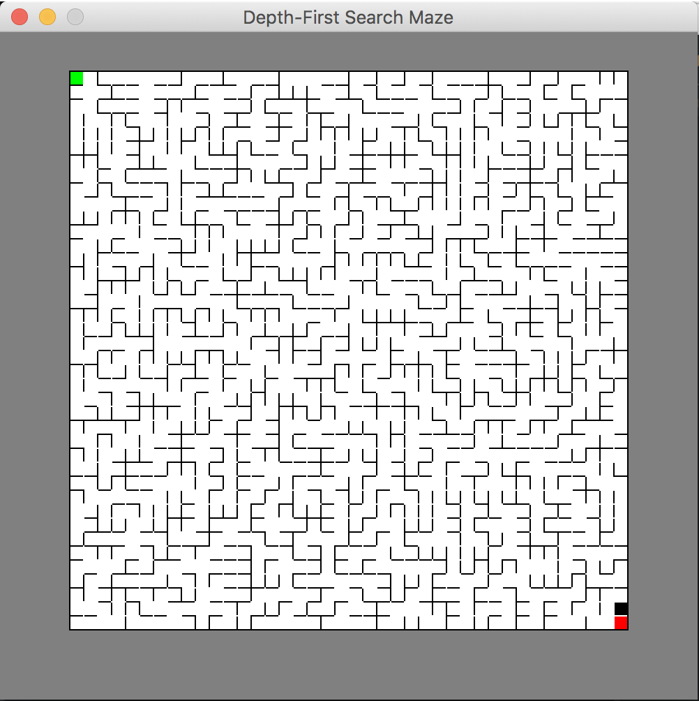
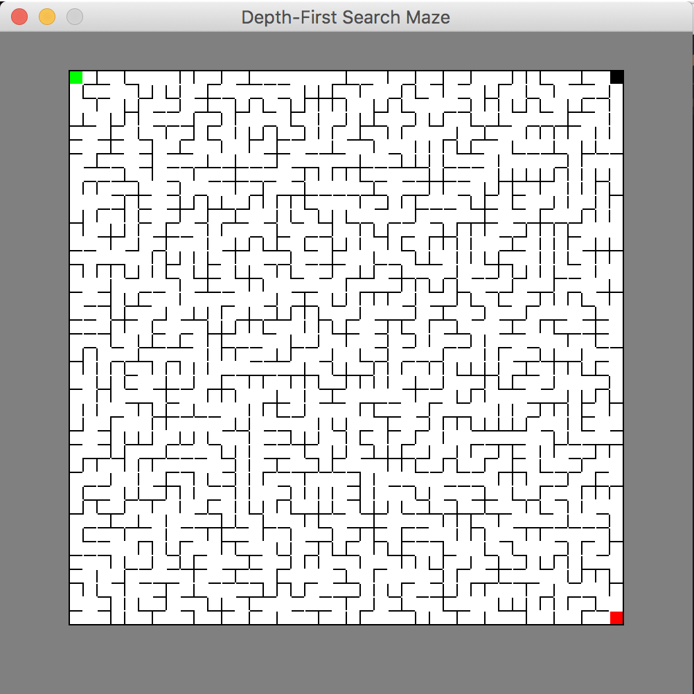

# Maze-Generator

This is a randomized maze-generating program that I wrote in my Junior year of high school. It uses a 
recursive backtracker implementation of the Depth-first-search algorithm to generate a unique maze in Java

Here are a couple samples generated by this program!

